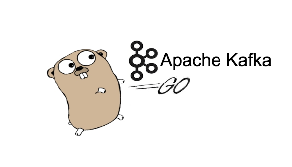

<h1 align="center">
  
</h1>

<h1 align="center">Kafka Clone</h1>
<p align = "center">A TCP server that accepts connections and works like a streaming system like Kafka. </p>

<p align="center">
  <a href="#-technology">Technology</a>&nbsp;&nbsp;&nbsp;|&nbsp;&nbsp;&nbsp;
    <a href="#-project">Project</a>&nbsp;&nbsp;&nbsp;|&nbsp;&nbsp;&nbsp;
  <a href="#-how-to-run">How to Run</a>&nbsp;&nbsp;&nbsp;|&nbsp;&nbsp;&nbsp;
  <a href="#-license">License</a>
</p>

<p align="center">
  
</p>

## Introduction
The objective of this project is to develop a TCP server that operates as a streaming system, comparable to Kafka. The server should be capable of accepting connections and enabling clients to send and receive messages from various topics or queues. To effectively manage multiple connections and topics, it is essential to ensure that the server is reliable and efficient, with a design that can support scalability and fault tolerance. Developing this project will require a good understanding of network programming, data serialization, and message queuing systems.

The following challenge can be found [here](https://app.devgym.com.br/challenges/1ccb06b2-ce93-4450-a17f-9f2479664cff).

## ✨ Technology

The Project was develop as using the following techs:
- [Go](https://go.dev/)
- [Google UUID](https://github.com/google/uuid)


## 💻 Project
This repository houses a Go package that offers an implementation of Kafka clone. It equips users with essential functions to effortlessly publish messages to a topic and consume messages from it. Notably, the package incorporates a convenient method of persisting messages using json files. Furthermore, it encompasses a user-friendly command-line tool that facilitates seamless interaction with the Kafka server.

## 🚀 How to Run
1. Clone the repository
2. Change to the project directory
3. Install go dependecies, `go mod tidy`
4. Run the server:
    * `go run cmd/server/main.go` 

5. Run the client consumer:
    * `go run cmd/cli/main.go -c -n <consumer> -t <topico>`
6. Run the client to publish messages:
    * `go run cmd/cli/main.go -p -t <topic> -m <message>` 

We also implement integration tests to ensure that all the functionalities are working well. We conduct the tests using the following command:
```bash
go test -v ./...
```

## 📄 License
The projects is under the MIT license. See the file [LICENSE](LICENSE) fore more details

---
## Author

Made with ♥ by Rafael 👋🏻


[](https://www.linkedin.com/in/rafael-mgr/)
[](mailto:ribeirorafaelmatehus@gmail.com)